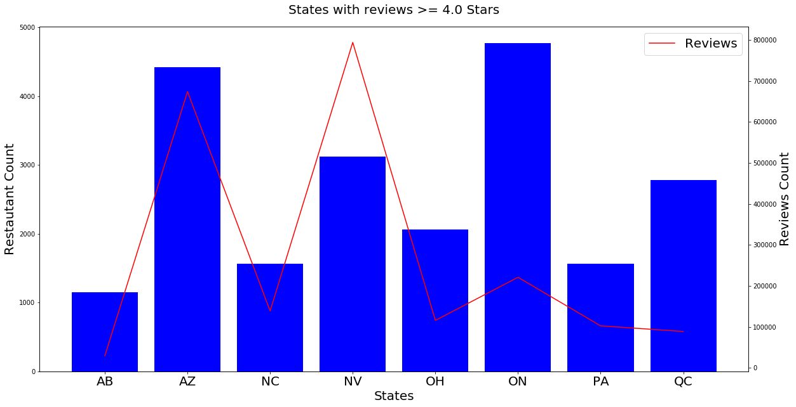

# Restaurant Reviews
Analysis of Restaurant Reviews based on Yelp Dataset

## Database: MongoDB
Using Docker, I set up a MongoDB container. Reading the files from Python, I store the information into my MongoDB tables:

* User Table
* Reviews Table
* Business Table
* Checkin Table
* Tip Table

I converted the tables into DataFrames

### Filtering out irrelavant data
* I am interested only in the Restaurant Businesses. Hence I filtered out the Businesses that have Restaurants in the categories table from the Business Table

### Merge Restaurant Business with Reviews
Based on the business_id from the business table, I merged the restaurants table with the reviews table


### Plot Graph of Top Restaurants with Most Reviews
I plot a graph based on the top 50 restaurants with the most reviews:

```python
import matplotlib.pyplot as plt
most_reviews = restaurant_df.sort_values(by=['review_count'], ascending=False).head(50)

az = most_reviews[most_reviews['state'] == 'AZ']

fig, ax = plt.subplots(figsize=[20,10])
ax.set_title('Top 50 Resaturants with the Most Reviews', fontsize=20)
ax.bar(most_reviews['name'], most_reviews['review_count'], color= 'blue', label='NV')
ax.bar(az['name'], az['review_count'], color='red', label='AZ')
ax.set_xticklabels(most_reviews['name'], rotation=90)
ax.set_xlabel('Restaurants', fontsize=20)
ax.set_ylabel('Review Counts', fontsize=20)
plt.legend(fontsize=20)
plt.show()
```


### Graph of top 100 restaurants with Most Reviews

```python
colors = ['blue', 'green', 'red', 'brown', 'cyan', 'purple']
import matplotlib.pyplot as plt

st = {}
for idx, s in enumerate(state):
    st[idx] = most_reviews[most_reviews['state'] == s]

fig, ax = plt.subplots(figsize=[20,10])
ax.set_title('Top 100 Resaturants with the Most Reviews', fontsize=20)
ax.bar(most_reviews['name'], most_reviews['review_count'])
for idx, s in enumerate(state):
    ax.bar(st[idx]['name'], st[idx]['review_count'], color=colors[idx], label=s)
ax.set_xticklabels(most_reviews['name'], rotation=90)
ax.set_xlabel('Restaurants', fontsize=20)
ax.set_ylabel('Review Counts', fontsize=20)
plt.legend(fontsize=20)
```


### Graph of States with Reviews
```python
business_review = pd.merge(restaurant_df, review_df, left_on='business_id', right_on='business_id')
states_review = business_review.groupby('state')
src = states_review.count()['review_id']

fig, ax = plt.subplots(figsize=[20, 10])

ax.set_title('States with Reviews', fontsize=20, pad=20)
ax.set_xlabel('States', fontsize=20)
ax.set_ylabel('Review Counts', fontsize=20)
ax.plot(src)
```


### States with Top Reviews over the Years

```python
review_year = pd.DataFrame({"city": business_review['city'], "state": business_review['state'], 'year': business_review['date'].dt.year})
review_year

import matplotlib.pyplot as plt
fig, ax = plt.subplots(figsize=[20, 10])

ax.set_title('States with more than 100,000 Reviews over the Years', fontsize=20, pad=20)
ax.set_xlabel('Years', fontsize=20)
ax.set_ylabel('Number of Reviews', fontsize=20)

for k, v in st_re.head(4).items():
    year_count = review_year[review_year['state'] == k]
    graph_year = year_count.groupby('year').count().reset_index()
    ax.plot(graph_year['year'], graph_year['state'], label=k)

plt.legend(fontsize=20)
plt.show()
```


### States with Reviews >= 4.0 Stars

```python
fourStars = business_checkin[business_checkin['stars'] >= 4.0]

stars_attributes = pd.merge(fourStars, restaurant_df, left_on='business_id', right_on='business_id')
stars_attributes = stars_attributes.drop(columns=['latitude', 'longitude', 'stars_y', 'review_count_y', 'is_open', 'date', 'postal_code','name_y', 'city_y', 'state_y', '_id_x', '_id_y'])
stars_attributes = stars_attributes.rename(columns={'name_x': 'name','city_x': 'city', 'state_x': 'state', 'stars_x': 'stars', 'review_count_x': 'review_count'})
stars_attributes = stars_attributes.sort_values(by=['stars'], ascending=False)
states_stars_attributes = stars_attributes.groupby('state')
states_stars_attributes = states_stars_attributes.count()['business_id']
states_stars_attributes = pd.DataFrame(states_stars_attributes).reset_index()

fig, ax = plt.subplots(figsize=[20, 10])

ax.set_title('States with reviews >= 4.0 Stars', fontsize=20, pad=20)
ax.bar(states_stars_attributes['state'], states_stars_attributes['business_id'])
ax.set_xlabel('States', fontsize=20)
ax.set_ylabel('Number of Reviews', fontsize=20)
```



### Top Categories with Reviews >= 4.0 Stars
```python
cat_reviews = pd.DataFrame({'name': stars_attributes['name'], 'categories': stars_attributes['categories']})
cat = {}

for k, v in cat_reviews.items():
    if k == 'categories':
        r = v.str.split(",")
        for idx, ab in enumerate(r):
            for ele in r[idx]:
                eles = ele.strip()
                if eles in cat:
                    cat[eles] += 1
                else:
                    cat[eles] = 1

# Create DataFrame
cat_df = pd.DataFrame(list(cat.items()), columns=['Category Name', 'Count'])
cat_df = cat_df.sort_values(by=['Count'], ascending=False)
cat_df = cat_df[(cat_df['Category Name'] != 'Restaurants') & (cat_df['Category Name'] != 'Food')]

# Plot Graph
fig, ax = plt.subplots(figsize=[20, 10])


top_few = cat_df.head(15)
ax.bar(top_few['Category Name'], top_few['Count'])
ax.set_title('Top 15 Categories with Reviews >= 4.0 Stars', fontsize=20, pad=20)
ax.set_xticklabels(top_few['Category Name'], rotation=90, fontsize=20)
ax.set_yticklabels(top_few['Count'], fontsize=15)

ax.set_xlabel('Category Names', fontsize=20)
ax.set_ylabel('Count', fontsize=20)
```
