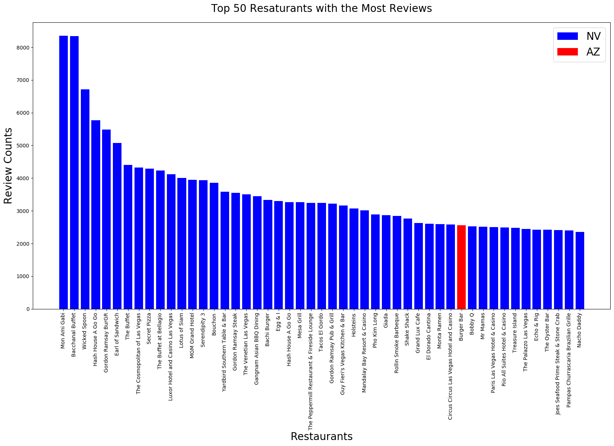

# Restaurant Reviews
Analysis of Restaurant Reviews based on Yelp Dataset

## Database: MongoDB
Using Docker, I set up a MongoDB container. Reading the files from Python, I store the information into my MongoDB tables:

* User Table
* Reviews Table
* Business Table
* Checkin Table
* Tip Table

I converted the tables into DataFrames

### Filtering out irrelavant data
* I am interested only in the Restaurant Businesses. Hence I filtered out the Businesses that have Restaurants in the categories table from the Business Table

### Merge Restaurant Business with Reviews
Based on the business_id from the business table, I merged the restaurants table with the reviews table

I plot a graph based on the top 50 restaurants with the most reviews:

```python
most_reviews = restaurant_df.sort_values(by=['review_count'], ascending=False).head(50)

az = most_reviews[most_reviews['state'] == 'AZ']

fig, ax = plt.subplots(figsize=[20,10])
ax.set_title('Top 50 Resaturants with the Most Reviews', fontsize=20)
ax.bar(most_reviews['name'], most_reviews['review_count'], color= 'blue', label='NV')
ax.bar(az['name'], az['review_count'], color='red', label='AZ')
ax.set_xticklabels(most_reviews['name'], rotation=90)
ax.set_xlabel('Restaurants', fontsize=20)
ax.set_ylabel('Review Counts', fontsize=20)
plt.legend(fontsize=20)
plt.show()
```
